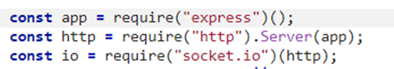
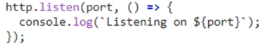

# Chat con socket.io y MongoDB (aprendizaje)

## Pasos
### Instalaciones
Se instala node.js
Se instalan las dependencias
- npm install socket.io
- npm install express@4

### Configurar servidor
Lo llamaremos server.js. Añadimos las dependencias

se accederá por el puerto 3000

se indica que la raíz será /index.html

"io" es como un broadcast, TODOS los clientes conectados
emit envía un mensaje, en el caso de ponerle io delante se envía a todos los clientes

le dices el puerto a escuchar, puerto por el cual se conectan los clientes en el navegador

 
#### Para arrancar el servidor
node server.js

### Configuración del cliente
Utilizamos index.html
Añadimos el script de socket

Creamos la variables para recibir mensajes de chat y se añadimos un eventlistener al input para hacer emit del mensaje

Función que muestra los mensajes que se reciben

## webología
- socket io chat example: https://socket.io/get-started/chat
